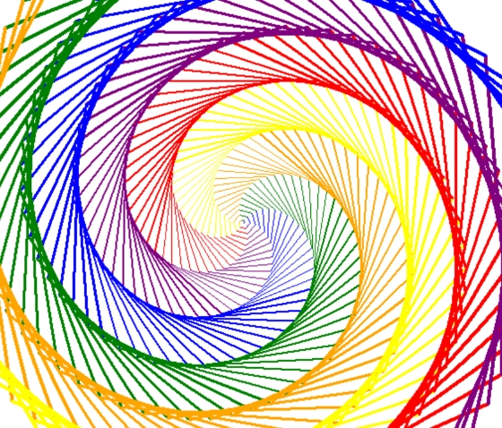

# Turtle--Graphics-Designs

  

### About This
This project is a showcase of creative coding using Python Turtle Graphics. Each .py file in this repository generates a unique design, demonstrating different ways to manipulate the turtle's movement, colors, and drawing parameters to produce diverse visual outputs.

I enjoy exploring the possibilities of simple algorithms to create complex and beautiful art, and Turtle Graphics is a fantastic tool for this!

  

### Requirements
Python 3.x
The built-in turtle module (no external installations needed!)

### Techstack

 
